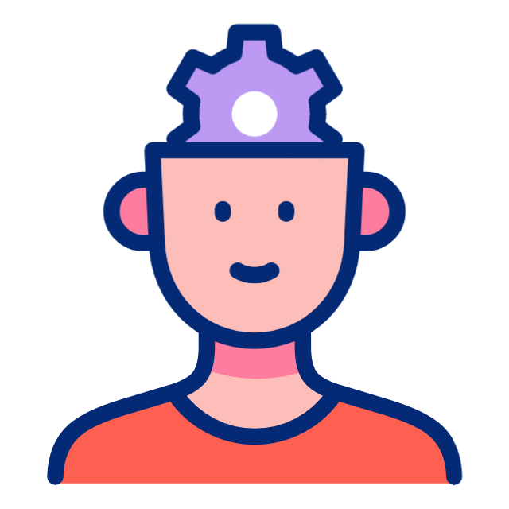

<!-- ТЕКСТ НАВЕРХУ СТРАНИЦЫ -->

  

    

Нажимайте на карточку, чтобы увидеть ответ     
  🧠 
Если вопрос вызвал затруднение, нажмите на кнопку «для повторения» под карточкой    
    📖 
Список затруднительных вопросов появится в самом низу страницы     
    📸 
Можно заскринить его
  

<!-- КАРТОЧКА №1 -->

  

    

      

        <b id="q1">Три стадии аллергии</b>
      

      
1. Иммунологическая   2. Патохимическая  3. Патофизиологическая 

    

  

  <button class="add-btn" onclick="addToEnd('q1', this)">ДЛЯ ПОВТОРЕНИЯ</button>

<!-- КАРТОЧКА №2 -->

  

    

      

        <b id="q2">Четыре примера аллергена, перекрёстных с латексом</b>
      

      

    

  

  <button class="add-btn" onclick="addToEnd('q2', this)">ДЛЯ ПОВТОРЕНИЯ</button>

<!-- КАРТОЧКА №3 -->

  

    

      

        <b id="q3">Как переводится "Bread"?</b>
      

      
Хлеб

    

  

  <button class="add-btn" onclick="addToEnd('q3', this)">ДЛЯ ПОВТОРЕНИЯ</button>

<!-- ИТОГОВЫЙ СПИСОК -->

  <h3>тема: Аллергия-1  📖  🧠  📸</h3>
  <ul id="selected-list" style="font-size: 1.1rem; line-height: 2;"></ul>

