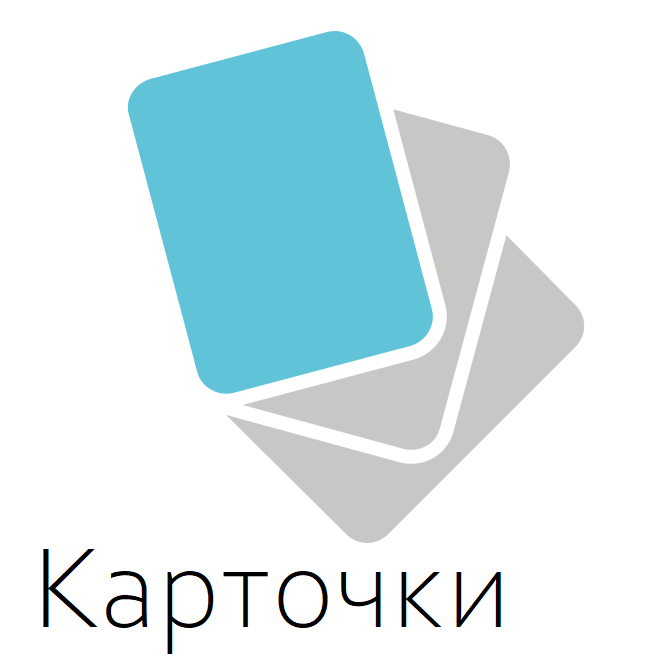
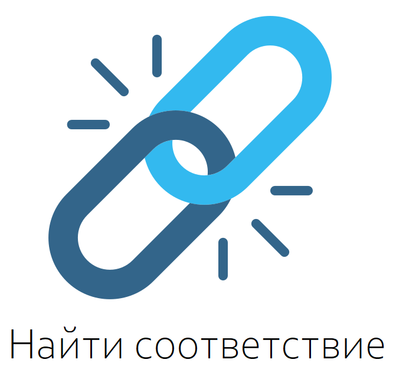
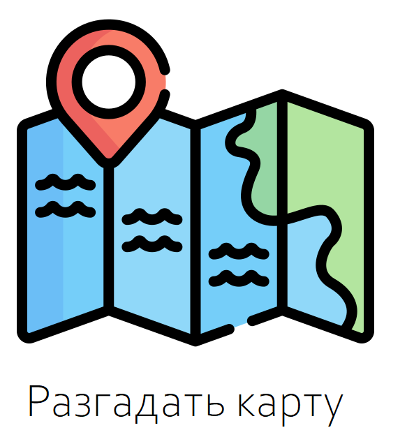

# лекция №1  Аллергия
 

>

&emsp;&emsp;&emsp;&emsp; 
 

&emsp;&emsp;&emsp;&emsp;&emsp; 
 
 
[назад](1_Аllergy.md) 
 
 
 
 

<footer>           
by cartographer CC BY-NC-SA 4.0  

при создании страницы использовались: 
<a href="https://www.flaticon.com/free-icons/flash-card" title="flash card icons">Flash card icons created by manshagraphics - Flaticon</a> 
<a href="https://www.flaticon.com/free-icons/map" title="map icons">Map icons created by Freepik - Flaticon</a> 
<a href="https://www.flaticon.com/free-icons/board-game" title="board game icons">Board game icons created by Freepik - Flaticon</a> 
<a href="https://www.flaticon.com/free-icons/link" title="link icons">Link icons created by nawicon - Flaticon</a> 
<a href="https://www.flaticon.com/free-icons/diagnosis" title="diagnosis icons">Diagnosis icons created by nawicon - Flaticon</a>
</footer>
