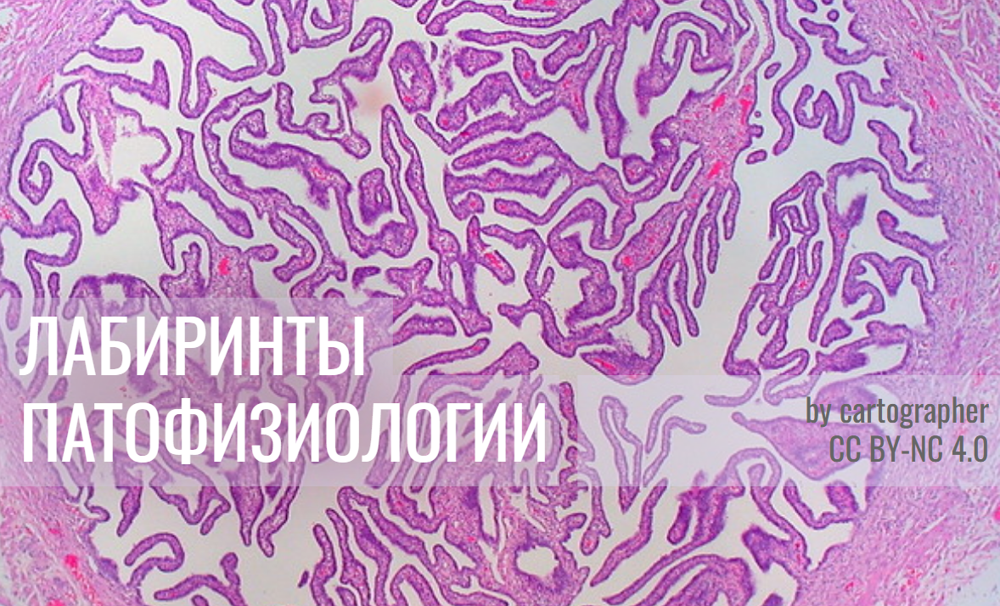

<html>
<head>
<link href='https://fonts.googleapis.com/css?family=Comfortaa' rel='stylesheet'>
<link href='https://fonts.googleapis.com/css?family=Montserrat' rel='stylesheet'>
<link href='https://fonts.googleapis.com/css?family=Cormorant' rel='stylesheet'>

 
</head>

<body>
 <!-- <header>
  
</header>-->
  
раздел II   
Регyляция артериального давления  
 

<fieldset>
  <legend>здесь мы узнаем:  </legend>

  

    <input type="checkbox" id="f1" name="f1"/>
    <label for="f1">как взаимосвязаны давление, поток и сопротивление </label>
  

  

    <input type="checkbox" id="f2" name="f2" />
    <label for="f2">как давление зависит от сердечного выброса</label>
  

    

    <input type="checkbox" id="f3" name="f3" />
    <label for="f3">как давление зависит от сопротивления </label>
  

    

    <input type="checkbox" id="f4" name="f4" />
    <label for="f4">важно ли для кардиологии то, что сердце - это пульсирющий (а не "плавный") насос? (индекс аугментации и пр.)</label>
  

    

    <input type="checkbox" id="f5" name="f5" />
    <label for="f5">симпато-адреналовая система (САС)</label>
  

  
    

    <input type="checkbox" id="f6" name="f6" />
    <label for="f6">ренин-ангиотензин-альдостероновая система (РААС) и контр-РААС</label>
  

  
    

    <input type="checkbox" id="f7" name="f7" />
    <label for="f7">другие важные вещи: натрий-уретические пептиды, инсулин, гормон роста, гормоны щитовидной железы и пр.   и др.</label>
  

</fieldset>

   
  
  
  

Здесь мы будем обсуждать то, что важно для кардиологии. Давление и перфузия (кровоснабжение тканей), очевидно, важны и для других областей медицины - например, для интенсивной терапии (массивная кровопотеря, шок и др.). Этим аспектам внимание будет уделено в "Патофизиологии критических состояний" (ссылка: еще не готова)
    
  
  
  

 <!-- стеноз, СОАС, брадикардия -->

Прежде, чем начать изучение, рассмотрим клинический случай 
 

Клинический случай №1  
Анамнез и жалобы: Пациент, 16 лет  
Физикальное обследование: 
Лабораторно: 
Инструментально: 
 
 
Вопросы:  
 

Ответы на эти вопросы мы узнаем после изучения этого раздела
 

 
 
 

Итак,  
ЧАСТЬ 1. Как взаимосвязаны поток-давление-сопротивление
 
  
  

Поток - это сколько литров (или милилитров, или микролитров) протекает по трубочке за секунду (или за минуту, или за час).   
Поток также называют объемной скоростью, но не путаем ее с обычной (линейной) скоростью - сколько метров за секунду.   
 
Для лучшего понимания разницы между объемной скоростью и линейной скоростью, представим себе огромную реку, которая медленно течет по равнине. Если мы поместим в реку игрушечный кораблик, он будет плыть медленно (преодолевать мало метров в секунду). Следовательно, линейная скорость воды в реке - низкая. А что насчет объемной скорости? Как много литров протекает по реке за секунду? Очень много, так как река очень широкая (у нее большое русло).  
Напротив, по быстрой горной реке протекает гораздо меньший объем (меньше литров за секунду), но вода движется очень быстро.  
 
 
Объемная скорость обозначается буквой Q (иногда V c точекой наверху), единица измерения - л/сек (более строго - кубический метр (1000 л)/сек)  
 
 
Что "заставляет" жидкость двигаться по трубочке?  
 
Ответ - разница (градиент) давлений - жидкость движется из области высокого давления в область низкого.  
Высокое давление "толкает"/"выдавливает" жидкость туда, где давление меньше.
   

(Строго говоря это не так - жидкость двигается из-за градиента энергии, а не градиента давления. Подробнее в первом разделе "Minimum minimorum из физики")
 

Градиент давления обозначается так: P1 минус P2 (или ΔP)   
P1 - это давление в начале трубочки, P2 - давление в конце трубочки    
 
А где начало и конец трубочки в живом организме? Какая трубочка имеется в виду?  
Здесь мы обсуждаем артериальное давление - то есть давление в артериях большого круга   
Следовательно, здесь нас интересует большой круг. Где его начало и конец?  
Это левый желудочек (начало) 🠊 оттуда кровь идет в аорту и артерии большого круга  🠊 затем в микроциркуляцию  🠊 затем вены большого круга и полые вены  🠊 которые впадают в правое предсердие (конец)   
 

 
Таким образом,  
Р1 - это давление на выходе из левого желудочка/входе в аорту  
То есть - артериальное давление  
 
Р2 - это давление в правом предсердии (в клиническом контексте - это центральное венозное давление (ЦВД)) 
 
  

Итак,  
мы узнали, что такое поток/объемная скорость (Q) и градиент давлений (ΔP), который "заставляет" жидкость течь. 
Поскольку ΔP "помогает" жидкости течь, Q и ΔP связаны прямой зависимостью (если больше одно, то больше другое) 
 
 
А кто мешает жидкости течь? 
Или, по-другому, почему жидкость, текущая по трубе, замедляется? Если насос не будет ее "толкать", она остановится 
То же самое - почему тележка, которую толкнули на ровной дороге, сперва катится, но потом замедляется и останавливается? 
 
Ответ - мешает трение.  
Колеса тележки "трутся" о дорогу и часть энергии, данной толчком, рассеивается в виде тепла. 
Молекулы жидкости "трутся" о стенки трубки и происходит то же самое.  
А еще молекулы жикости "трутся" друг о друга - можно сказать, что это 'внутренее' трение 
ВЯЗК спойлер
 
 
Делаем вывод, 
жидкости мешает течь:  1. трение о стенки и 2. вязкость самой жидкости  
Если радиус (следовательно, поперечное сечение) трубочки маленький, то трение будет выше или ниже? Жидкости будет легче или тяжелее "протискиваться" в такую трубочку? 
СПОЙЛЕР
 
Таким образом, течение жидкости зависит от: 1. площади поперечного сечения (πr2) и 2. η 
 
Эти два фактора, как мы узнали, не помогают, а мешают течь, следовательно Q и эти два фактора связан обратной заисимостью - чем больше эти два фактора, тем меньше Q (два фактора в знаменателе) 
 
Ученые Г. Хаген и Ж.Л. Пуазёйль изучали зависимость Q и (1. πr2 и 2. η). Проделывая эксперименты с трубочками, они показали, что Q зависит не просто от πr2, а от πr4 (в четвертой степени).  
То есть, если r одной трубочки, меньше в 2 раза, чем у другой, то во сколько раз меньше Q в этой трубочке по сравнению с другой? 
 
 
 Также Г. Хаген и Ж.Л. Пуазёйль в экспериментах установили, что Q зависит от двух факторов (πr4 и η), которые еще нужно умножить на 8 
 
Собирательно два фактора, которые мешают жидкости течь назваются сопротивлением (R) 
 
Согласно закону Хагена-Пуазёйля: 
R = 8πr4 × η  
 
 
 
Вспомним, как называется эта часть 1 главы 2, которую Вы сейчас читаете 
Как взаимосвязаны поток-давление-сопротивление 
 
 Теперь мы знаем ответ на этот вопрос 
Потоку "помогает" градиент давлений (следовательно, он в числителе) и "мешает" сопротивление (следовательно, оно в знаменателе)  
То же самое в виде формулы:  
 
 Вместо R можно подставить... 
СПОЙЛЕР 
 
 
 
Можно поменять формлу, согласно правилам арифметики, так: 
 
 
 
В таком виде она нам здесь даже более интересна. Ведь мы обсуждаем, от чего зависит артериальное давление. 
Получается, градиент давлений между началом (левый желудочек-аорта) и концом (правое предсердие) зависит от: 
1. Q  
2. R = 8πr4 × η  
 
 
Возможно у Вас возник вопрос - кто от кого зависит: поток от даления или даление от потока. Можно привести аналогию: студент обучается благодаря учителю или учитель обучает благодаря студенту (если бы его не было, что бы делал учитель?). Они взаимозависимы и оба являются равноправными субъектами образования.  
Так и нашу формулу можно записать по-разному. Поскольку здесь мы изучаем давление, нам интереснее второй вариант 
 
 
Как мы помним Q - это сколько литров за секунду течет по трубочке  
Откуда эти литры поступают в большой круг? Из сердца (левого желудочка).  
Оно выбрасывает 3-5 литров в минуту в покое (у разных людей по-разному, зависит от пола, тренированности и т.д.). Это минутный объем крови - МОК. Затем эти литры текут дальше по большому кругу.  
Такми образом, мы можем сказать, что Q ~ МОК  
Сам МОК, очевидно, складывается из числа сокращений за минуту (ЧСС) и объема, который выбрасывается за одно сокращение (ударный объем, УО)  
МОК = ЧСС × УО   
  
  
Также мы помним, что ΔP - это P в начале - P в конце  
Если речь о большом круге - это Pартериальное - ЦВД   
  
  
 Теперь сформулируем, чему равно Pартериальное  
   
    
В норме значение ЦВД немного отклоняется от нуля и сильно меньше, чем P артериальное. Поэтому мы можем упростить формулу, удалив ЦВД  
 
уточнение 
 
 
 
 
ДЛИНУ ДОБАВИТЬ

Итак, мы изучили часть1 (как сязаны поток-даление-сопротиление) 
Потренируемся использовать эти знания 
 
 

I. Насосу легче толкать воду по водопроводу или мёд по медопроводу (авторы не уверены в существовании последнего)? Почему?
СПОЙЛЕР 
 
 

II. Представим себе аквариум с водой. Из него по одной трубочке вытекает вода. 
Сколько нужно трубочек, у которых радиус в два раза меньше, чем у той одной трубочки, чтобы из бассейна вытекало столько же литров в секунду. 
СПОЙЛЕР 
 
 

III. Просвет (площадь поперечного сечения - πr2) артерии уменьшился из-за атеросклеротической бляшки на 20%. Как изменится перфузия (поступление крови, сколько литров/с) той ткани, которую кровоснабжает артерия (вообразим, что больше ничего не изменилось, то есть не было никакого ответа организма, в реальности так не будет)? Такой же вопрос можно задать и про бронх, просвет которого уменьшился из-за бронхообструкуции (астма и ХОБЛ).
СПОЛЙЛЕР
 
 

IV. Почему при эритроцитозе (когда много эритроцитиов) может быть артериальная гипертензия (напр. синдром Гайсбека)? 
СПОЙЛЕР 
 
 

V. Лекарства, блокирующие кальциевые каналы L-типа, "расслабляют" гладкие мышцы артериол, и те расширяются.  
Как это отразится на артериальном давлении? 
Как это отразится на притоке крови в микроциркуляторное русло тканей? К какому побочному эффекту это может привести?  
В приносящей артериоле почечного клубочка много каналов L-типа, а в выносящей - Т-типа. Зная это, предположим, как эти лекарства подействуют на фильрацию в клубочке  
СПОЙЛЕР 
 
 

VI. Лекарства, блокирующие β1-адренорецепторы с сердце, снижают ЧСС.  
Как это отразится на артериальном давлении? 
Как это отразится на времени диастолы? Какое это имеет значение?  
В приносящей артериоле почечного клубочка много каналов L-типа, а в выносящей - Т-типа. Зная это, предположим, как эти лекарства подействуют на фильрацию в клубочке  
СПОЙЛЕР 
 
 

VII. ЧСС.  
Как это отразится на артериальном давлении? 

СПОЙЛЕР 
 
 

 
ЧАСТЬ 2. Давление и сердечный выброс
 
  
  

 
Что еще за сердечный выброс (СВ)?  
Сердечный выброс (cardiac output) - это синоним МОК   
Мы уже знаем, что ΔP = МОК (или СВ) × R   
А от чего зависит МОК/СВ?  
 СПОЙЛЕР
Нужно умножить число сокращений за минуту (ЧСС) на объем, выбрасываемый за одно сокращение (ударный объем, УО)   
СВ = ЧСС  × УО   
  
  
  
уточнение СИ
  
  

  
     
А от чего зависят ЧСС и УО?    
Начнем с ЧСС   
   
    
Здесь мы коснемся без глубоких подробностей:    
☐ стимуляция β1-адренорецепторов   
&nbsp;&nbsp;&nbsp;&nbsp; оооо

 

 
 
  
  

</body> 
</html>
