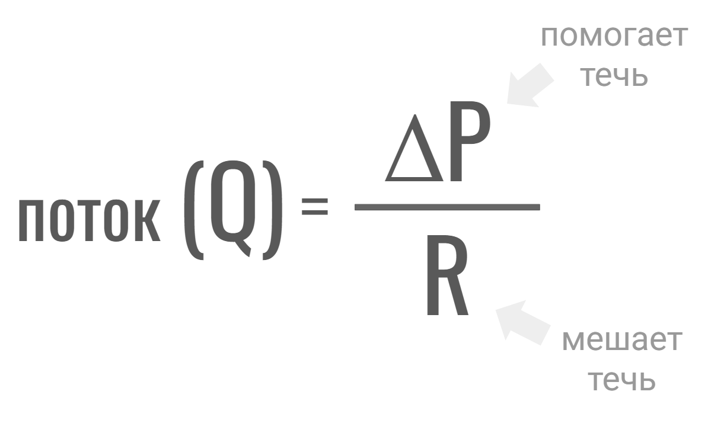

<html>
<head>
<link href='https://fonts.googleapis.com/css?family=Comfortaa' rel='stylesheet'>
<link href='https://fonts.googleapis.com/css?family=Montserrat' rel='stylesheet'>
<link href='https://fonts.googleapis.com/css?family=Cormorant' rel='stylesheet'>
<link href='https://fonts.googleapis.com/css?family=Nunito' rel='stylesheet'>

 
</head>

 <!-- <header>
  
</header>-->
  
раздел II   
Регyляция артериального давления  
 

<fieldset>
  <legend>здесь мы узнаем:  </legend>

  

    <input type="checkbox" id="f1" name="f1"/>
    <label for="f1">как взаимосвязаны давление, поток и сопротивление </label>
  

  

    <input type="checkbox" id="f2" name="f2" />
    <label for="f2">как давление зависит от сердечного выброса</label>
  

    

    <input type="checkbox" id="f3" name="f3" />
    <label for="f3">как давление зависит от сопротивления </label>
  

    

    <input type="checkbox" id="f4" name="f4" />
    <label for="f4">важно ли для кардиологии то, что сердце - это пульсирющий (а не "плавный") насос? (пульсовая волна, виндкесель, индекс аугментации и пр.)</label>
  

    

    <input type="checkbox" id="f5" name="f5" />
    <label for="f5">симпато-адреналовая система (САС)</label>
  

  
    

    <input type="checkbox" id="f6" name="f6" />
    <label for="f6">ренин-ангиотензин-альдостероновая система (РААС) и контр-РААС</label>
  

  
    

    <input type="checkbox" id="f7" name="f7" />
    <label for="f7">другие важные вещи: натрий-уретические пептиды, инсулин, гормон роста, гормоны щитовидной железы и пр.   и др.</label>
  

</fieldset>

   
  
  
  

Здесь мы будем обсуждать то, что важно для кардиологии. Давление и перфузия (кровоснабжение тканей), очевидно, важны и для других областей медицины - например, для интенсивной терапии (массивная кровопотеря, шок и др.). Этим аспектам внимание будет уделено в "Патофизиологии критических состояний" (ссылка: еще не готова)
    
  
  
  

 <!-- стеноз, СОАС, брадикардия -->

Прежде, чем начать изучение, рассмотрим клинический случай  
 

Клинический случай №1  
Анамнез и жалобы: Пациент, 16 лет  
Физикальное обследование: 
Лабораторно: 
Инструментально: 
 
 
Вопросы:  
 
Ответы на эти вопросы мы узнаем после изучения этого раздела
 
 
 
 

Итак,  
ЧАСТЬ 1.  
Как взаимосвязаны поток-давление-сопротивление
 
  
  

Поток - это сколько литров (или милилитров, или микролитров) протекает по трубочке за секунду (или за минуту, или за час).   
Поток также называют объемной скоростью, но не путаем ее с обычной (линейной) скоростью - она показывает, сколько метров за секунду. 
  
 
Для лучшего понимания разницы между объемной скоростью и линейной скоростью, представим себе огромную реку, которая медленно течет по равнине. Если мы поместим в реку игрушечный кораблик, он будет плыть медленно (преодолевать мало метров в секунду). Следовательно, линейная скорость воды в реке - низкая. А что насчет объемной скорости? Как много литров протекает по реке за секунду? Очень много, так как река очень широкая (у нее большое русло).  
Напротив, по быстрой горной реке протекает гораздо меньший объем (меньше литров за секунду), но вода движется очень быстро.
 
 
Объемная скорость обозначается буквой Q (иногда V c точекой наверху), единица измерения - л/сек (более строго - кубический метр (1000 л)/сек) 
 
 
 
Что "заставляет" жидкость двигаться по трубочке?  
Разница (градиент) давлений - жидкость движется из области высокого давления в область низкого.  
Высокое давление "толкает"/"выдавливает" жидкость туда, где давление меньше.
    

(Строго говоря это не так - жидкость двигается из-за градиента энергии, а не градиента давления. Подробнее в первом разделе "Minimum minimorum из физики")
   

Градиент давления обозначается так: P1 минус P2 (или ΔP)   
P1 - это давление в начале трубочки, P2 - давление в конце трубочки    
 
А где начало и конец трубочки в живом организме? Какая трубочка имеется в виду?  
Здесь мы обсуждаем артериальное давление - то есть давление в артериях большого круга   
Следовательно, здесь нас интересует большой круг. Где его начало и конец?   
Это левый желудочек (начало) 🠊 оттуда кровь идет в аорту и артерии большого круга 🠊 затем в микроциркуляцию 🠊 затем вены большого круга и полые вены 🠊 которые впадают в правое предсердие (конец)   
 
Таким образом,  
Р1 - это давление на выходе из левого желудочка/входе в аорту  
То есть - артериальное давление  
 
Р2 - это давление в правом предсердии (в клиническом контексте - это центральное венозное давление (ЦВД)) 
 
  

Итак,  
мы узнали, что такое поток/объемная скорость (Q) и градиент давлений (ΔP), который "заставляет" жидкость течь. 
Поскольку ΔP "помогает" жидкости течь, Q и ΔP связаны прямой зависимостью (если больше одно, то больше другое) 
 
 
А кто мешает жидкости течь? 
Или, по-другому, почему жидкость, текущая по трубе, замедляется? Если насос не будет ее "толкать", она остановится 
То же самое - почему тележка, которую толкнули на ровной дороге, сперва катится, но потом замедляется и останавливается? 
 
Ответ - мешает трение.  
Колеса тележки "трутся" о дорогу и часть энергии, данной толчком, рассеивается в виде тепла. 
Молекулы жидкости "трутся" о стенки трубки и происходит то же самое.  
А еще молекулы жикости "трутся" друг о друга - можно сказать, что это 'внутренее' трение 
ВЯЗК спойлер
 
 
 
Делаем вывод, 
жидкости мешает течь:  1. трение о стенки и 2. вязкость самой жидкости  
Если радиус (следовательно, поперечное сечение) трубочки маленький, то трение будет выше или ниже? Жидкости будет легче или тяжелее "протискиваться" в такую трубочку? 
СПОЙЛЕР
 
Таким образом, течение жидкости зависит от: 1. площади поперечного сечения (πr2) и 2. η 
 
Эти два фактора, как мы узнали, не помогают, а мешают течь, следовательно Q и эти два фактора связаны обратной заисимостью - чем больше эти два фактора, тем меньше Q (два фактора в знаменателе) 
 
Ученые Г. Хаген и Ж.Л. Пуазёйль изучали зависимость Q и (1. πr2 и 2. η). Проделывая эксперименты с трубочками, они показали, что Q зависит не просто от πr2, а от πr4 (в четвертой степени).  
То есть, если r первой трубочки, меньше в 2 раза, чем у второй, то во сколько раз меньше Q в первой трубочке по сравнению со второй? 
 
 
 Также Г. Хаген и Ж.Л. Пуазёйль в экспериментах установили, что Q зависит от трех факторов (πr4 и η), которые еще нужно умножить на 8 
 
Собирательно два фактора, которые мешают жидкости течь назваются сопротивлением (R) 
 
Согласно закону Хагена-Пуазёйля: 
R = 8πr4 × η  
 
 
 
Вспомним, как называется эта часть 1 главы 2, которую Вы сейчас читаете 
Как взаимосвязаны поток-давление-сопротивление 
 
 Теперь мы знаем ответ на этот вопрос 
Потоку "помогает" градиент давлений (следовательно, он в числителе) и "мешает" сопротивление (следовательно, оно в знаменателе)  
То же самое в виде формулы:  
   
 Вместо R можно подставить... 
СПОЙЛЕР 
 
 
 
Можно поменять формлу, согласно правилам арифметики, так: 
    
 
 
В таком виде она нам здесь даже более интересна. Ведь мы обсуждаем, от чего зависит артериальное давление. 
Получается, градиент давлений между началом (левый желудочек-аорта) и концом (правое предсердие) зависит от: 
1. Q  
2. R = 8πr4 × η  
 
 
Возможно у Вас возник вопрос - кто от кого зависит: поток от давления или давление от потока. Можно привести аналогию: студент обучается благодаря учителю или учитель обучает благодаря студенту (если бы его не было, что бы делал учитель?). Они зависят друг от друга.  
Так и нашу формулу можно записать по-разному. Поскольку здесь мы изучаем давление, нам интереснее второй вариант (ΔP = Q × R) 
 
 
Как мы помним Q - это сколько литров за секунду течет по трубочке  
Откуда эти литры поступают в большой круг? Из сердца (левого желудочка).  
Оно выбрасывает 3-5 литров в минуту в покое (у разных людей по-разному, зависит от пола, тренированности и т.д.). Это минутный объем крови - МОК. Затем эти литры текут дальше по большому кругу.  
Таким образом, мы можем сказать, что Q ~ МОК  
Сам МОК, очевидно, складывается из числа сокращений за минуту (ЧСС) и объема, который выбрасывается за одно сокращение (ударный объем, УО)  
МОК = ЧСС × УО   
  
  
Также мы помним, что ΔP - это P в начале - P в конце  
Если речь о большом круге - это Pартериальное - ЦВД   
  
  
 Теперь сформулируем, чему равно Pартериальное  
   
    
В норме значение ЦВД немного отклоняется от нуля и сильно меньше, чем P артериальное. Поэтому мы можем упростить формулу, удалив ЦВД  
 
уточнение 
 
 
 
 
ДЛИНУ ДОБАВИТЬ

Итак, мы изучили часть1 (как сязаны поток-даление-сопротиление) 
Потренируемся использовать эти знания 
 
 

I. Насосу легче толкать воду по водопроводу или мёд по медопроводу (авторы не уверены в существовании последнего)? Почему?
СПОЙЛЕР 
 
 

II. Представим себе аквариум с водой. Из него по одной трубочке вытекает вода. 
Сколько нужно трубочек, у которых радиус в два раза меньше, чем у той одной трубочки, чтобы из бассейна вытекало столько же литров в секунду. 
СПОЙЛЕР 
 
 

III. Просвет (площадь поперечного сечения - πr2) артерии уменьшился из-за атеросклеротической бляшки на 20%. Как изменится перфузия (поступление крови, сколько литров/с) той ткани, которую кровоснабжает артерия (вообразим, что больше ничего не изменилось, то есть не было никакого ответа организма, в реальности так не будет)? Такой же вопрос можно задать и про бронх, просвет которого уменьшился из-за бронхообструкуции (астма и ХОБЛ).
СПОЛЙЛЕР
 
 

IV. Почему при эритроцитозе (когда много эритроцитиов) может быть артериальная гипертензия (напр. синдром Гайсбека)? 
СПОЙЛЕР 
 
 

V. Лекарства, блокирующие кальциевые каналы L-типа, "расслабляют" гладкие мышцы артериол 🠊 артериолы расширяются  
Как это отразится на артериальном давлении? Почему? 
Как это отразится на притоке крови в микроциркуляторное русло тканей? К какому побочному эффекту это может привести?  
В приносящей артериоле почечного клубочка много каналов L-типа, а в выносящей - Т-типа. Зная это, предположим, как эти лекарства подействуют на фильрацию в клубочке  
СПОЙЛЕР 
 
 

VI. Лекарства, блокирующие β1-адренорецепторы в сердце, снижают ЧСС  
Как это отразится на артериальном давлении? 
Как это отразится на времени диастолы? Какое это имеет значение?  
В приносящей артериоле почечного клубочка много каналов L-типа, а в выносящей - Т-типа. Зная это, предположим, как эти лекарства подействуют на фильтрацию в клубочке  
СПОЙЛЕР 
 
 

VII. ЧСС.  
Как это отразится на артериальном давлении? 

СПОЙЛЕР 
 

<h1>ЧАСТЬ 2.   
Давление и сердечный выброс</h1>
 
  
  

 
Что еще за сердечный выброс (СВ)?  
Сердечный выброс (cardiac output) - это синоним МОК   
Мы уже знаем, что ΔP = МОК (или СВ) × R   
А от чего зависит МОК/СВ?  
 СПОЙЛЕР
Нужно умножить число сокращений за минуту (ЧСС) на объем, выбрасываемый за одно сокращение (ударный объем, УО)   
СВ = ЧСС  × УО   
  
  
  
уточнение СИ
  
  

  
     
А от чего зависят ЧСС и УО?    
Начнем с ЧСС   
   

 
Увеличение ЧСС: 
 
вероятно, самый важный механизм - активация симпатоадреналовой системы (САС) 
(подробнее про САС будет в разделе №6 ниже)  
 
▢ Адреналин и норадреналин (?возможно, и дофамин) стимулируют β1-адренорецепторы в сердце 
С этим связано увеличение ЧСС при любой гипоксии (напр. курении, синдроме обструктивного апноэ сна (СОАС), болезнях легких, анемии), гипогликемии, физической нагрузке, лихорадке, перегревании, психоэмоциональном стрессе, боли и т.д. (при всех этих состояниях активируется САС) 
 
▢ Также разные факторы могут усиливать (потенциировать) САС и эффекты катехоламинов, или стимулировать их выброс в синаптическую щель, или мешать обратному захвату из синаптической щели и т.д. 
Важные примеры: гормоны цитовидной железы (Т3,Т4), инсулин, ангиотензин II, токсины (амфетамины, кокаин)  
▢ Также есть лекарства, похожие на катехоламины или усиливающие их эффекты, например:  
&nbsp;&nbsp;&nbsp;&nbsp;&nbsp;&nbsp;&nbsp;&nbsp;&nbsp;добутамин (в основном стимулирует β1)  
&nbsp;&nbsp;&nbsp;&nbsp;&nbsp;&nbsp;&nbsp;&nbsp;&nbsp;изопреналин (β1 и β2),  
&nbsp;&nbsp;&nbsp;&nbsp;&nbsp;&nbsp;&nbsp;&nbsp;&nbsp;β2-агонисты, такие как сальбутамол (немного действют и на β1)) 
&nbsp;&nbsp;&nbsp;&nbsp;&nbsp;&nbsp;&nbsp;&nbsp;&nbsp; допамин (лекарство-аналог дофамина)  
&nbsp;&nbsp;&nbsp;&nbsp;&nbsp;&nbsp;&nbsp;&nbsp;&nbsp; &nbsp;&nbsp;&nbsp;&nbsp;&nbsp;&nbsp;&nbsp;&nbsp;&nbsp; при средней скорости введения (2-10 мкг/кг/мин) β1 
&nbsp;&nbsp;&nbsp;&nbsp;&nbsp;&nbsp;&nbsp;&nbsp;&nbsp; &nbsp;&nbsp;&nbsp;&nbsp;&nbsp;&nbsp;&nbsp;&nbsp;&nbsp; при большой скорости введения (> 10 мкг/кг/мин) высвобожд   
▢ Также очевидно, что если резко бросить прием лекарств, снижающих ЧСС, может возникнуть тахикардия - напр. резкое бросание β-блокаторов, синдром отмены опиоидов  
▢ Также бывает опухоль, которая производит много катехоламинов - это называется феохромоцитома/параганглиома (подробнее в разделе про вторичные гипертензии) 
▢ Также другие вещества (кроме катехоламинов) могут увеличивать ЧСС, например:  
&nbsp;&nbsp;&nbsp;&nbsp;&nbsp;&nbsp;&nbsp;&nbsp;&nbsp;серотонин (5-гидрокситриптамин) через 5-HT4-рецепторы 
&nbsp;&nbsp;&nbsp;&nbsp;&nbsp;&nbsp;&nbsp;&nbsp;&nbsp;гистамин через H2-рецепторы) 
 
Кроме САС, есть еще вторая часть автономной нервной системы - это парасимпатическая нервная система (ПНС)  
Парасимпатическая инервация сердца происходит по блуждающему нерву (n. vagus, X пара черепнмозговых нервов) 
Медиатор ПНС - ацетилхолин  
Ацетилхолин действует на М2-холинорецепторы в сердце, от этого ЧСС снижается  
 
▢ Из этого мы делаем вывод - все факторы, ослабляющие парасимпатическую иннервацию сердца, могут вызвать тахикардию, например:
&nbsp;&nbsp;&nbsp;&nbsp;&nbsp;&nbsp;&nbsp;&nbsp;&nbsp;лекарства-холиноблокаторы 
&nbsp;&nbsp;&nbsp;&nbsp;&nbsp;&nbsp;&nbsp;&nbsp;&nbsp;поражение вагуса при сахарном диабете (в рамках автономной диабетической нейропатии); не только ПНС, но и САС может повредиться (как правило, позже) 
&nbsp;&nbsp;&nbsp;&nbsp;&nbsp;&nbsp;&nbsp;&nbsp;&nbsp;поражение вагуса при других патологиях (механическое повреждение, нейродегенеративные болезни (б. Паркинсона) и пр.) 
▢ Также бывают тахикардии непонятного происхождения (есть только гипотезы об их происхождении), напр. синдром постуральной ортостатической тахикардии, неадекватная (inappropriate) синусовая тахикардия
 
▢ Также другие патологии: электролитные расстройства, наследственные и приобретенные болезни серда (подробнее в главе "Аритмии"; ссылка еще не готова) и пр.  

 
Снижение ЧСС: 
 

Рассмотрим по такой же схеме, как мы изучили увеличение ЧСС: β1-рецептор и катехоламины, их помощники (T3, T4), вагус и ацетилхолин, прочее  
  
▢ снижают ЧСС все факторы, угнетающие функцию катехоламинов, напр. β-блокаторы (пропранолол, бисопролол, метопролол, небиволол) 
▢ гипофункция T3, T4 (гипотиреоз) 
▢ все факторы, усиливающие функцию вагуса 
&nbsp;&nbsp;&nbsp;&nbsp;&nbsp;&nbsp;&nbsp;&nbsp;&nbsp; холиномиметики, ингибиторы ацетилхолинэстеразы  
&nbsp;&nbsp;&nbsp;&nbsp;&nbsp;&nbsp;&nbsp;&nbsp;&nbsp; уретральный катетер  
▢ прочее  
&nbsp;&nbsp;&nbsp;&nbsp;&nbsp;&nbsp;&nbsp;&nbsp;&nbsp;аденозин, стимулирующий A1-рецепторы  
&nbsp;&nbsp;&nbsp;&nbsp;&nbsp;&nbsp;&nbsp;&nbsp;&nbsp;лекарства, блокирующие кальциевые (Са) каналы (верапамил, дилтиазем)  
&nbsp;&nbsp;&nbsp;&nbsp;&nbsp;&nbsp;&nbsp;&nbsp;&nbsp;лекарства, блокирующие натриевые (Na) каналы (лидокаин, антиконвульсанты)  
&nbsp;&nbsp;&nbsp;&nbsp;&nbsp;&nbsp;&nbsp;&nbsp;&nbsp;лекарства, блокирующие If каналы, ответственные за автоматизм СА-узла (ивабрадин)  
&nbsp;&nbsp;&nbsp;&nbsp;&nbsp;&nbsp;&nbsp;&nbsp;&nbsp;лекарства, alpha-2 adrenergic agonist   
&nbsp;&nbsp;&nbsp;&nbsp;&nbsp;&nbsp;&nbsp;&nbsp;&nbsp;лекарства, I   
&nbsp;&nbsp;&nbsp;&nbsp;&nbsp;&nbsp;&nbsp;&nbsp;&nbsp;другие лекарства (магния сульфат, наркотические анальгетики, аналоги соматостатина, киназные ингибиторы, модуляторы S1P-рецепторов и пр.)  
&nbsp;&nbsp;&nbsp;&nbsp;&nbsp;&nbsp;&nbsp;&nbsp;&nbsp;БАДы, пищевые добавки, 'препараты' с малодоказанной эффективностью (винпоцетин и пр.)   
&nbsp;&nbsp;&nbsp;&nbsp;&nbsp;&nbsp;&nbsp;&nbsp;&nbsp;электролитные расстройства   
&nbsp;&nbsp;&nbsp;&nbsp;&nbsp;&nbsp;&nbsp;&nbsp;&nbsp;наследственные и приобретенные болезни сердца (подробнее в главе "Аритмии"; ссылка еще не готова) 
 💊 ❶ ➀ 
 
 
  
Итак  
мы узнали, что СВ (сердечный выброс) = ЧСС  × УО   
также мы узнали от чего зависит ЧСС 
  
  
  
Теперь изучим УО (ударный объем)   
   
логически можно предположить, что он зависит от:    
➀ сколько крови (какой объем) притекает/возвращается к сердцу по венам   
➁ насколько сердечная мышца 'сильна', чтобы вытолкнуть этот объем   
➂ насколько сильно сопротивляются сосуды (артерии), в которые этот объем выталкивается   
 
  
Вспомним из физиологии, как по-научному называются эти три пунтка:    
➀    
➁    
➂    
   
  
 Рассмотрим эти пункты  
  
➀ Преднагрузка или венозный возврат ➀ 
  зависит от:
I. тонуса вен (вены умеют сокращаться, но гораздо слабее, чем артерии)
  сокращать вены могут катехоламины (), ангиотензин II, вазопрессин и др.
  расслаблять вены могут  и др.  
  
II. объема крови в венах   
он, очевидно, зависит от всего объема крови в сосудах и сердце - то есть ОЦК (объема циркулирующей крови)   
в венах находится примерно 70% всего ОЦК   
подробнее (ссылка)  
 
 
Подробнее изучим, от чего зависит ОЦК 
Из всех факторов нам будут наиболее интересны гормоны, регулирующие водно-электролитный баланс 
Подробнее (ссылка еще не готова)  
Кратко:   
1. Альдостерон - задерживает ➚ Na+ и ➚ воду, но выводит ➘ K+ и ➘ 'H+' 
2. Кортизол - делает то же самое ➚➚  ➘➘ 
 
3. Вазопрессин или АДГ (антидиуретический гормон) - действуя на V2-рецепторы в собирательных трубочках задерживает ➚ (почти) только воду  
4. Нартийуретические пептиды - выводят ➘ Na+ и ➘ воду
5. Другие - катехоламины, ангиотензин II, инсулин, гормон роста (СТГ), гормоны щитовидной железы, паращитовидной железы, половые гормоны - задерживают ➚ Na+ и ➚ воду (напрямую действуя на почку и/или на альдостерон)   
 
 
Помимо гормонов, на ОЦК могут повлиять:   
&nbsp;&nbsp;нарушения функции почек из-за болезней,  
&nbsp;&nbsp;внепочечные потери жидкости  
&nbsp;&nbsp;транскапилярный обмен - в норме жидкость выходит из капилляров в ткани (экстравазация); если этот процесс усилится 🠊 давление может снизиться 
&nbsp;&nbsp;&nbsp;&nbsp;(например, при анафилактическом шоке много гистамина, который снижает давление, 1. расширяя сосуды и 2. повышая их проницаемость; следовательно терапия включает инфузии жидкости, хотя жидкость не "вытекала" из тела), 
&nbsp;&nbsp;лекарства, действующие на что-либо из перечисленного. 
  
 
 
Это была ➀ преднагрузка  
двигаемся дальше,  
  
  
➁ Сократимость ➁   
1. стимуляция β1-рецепторов повышает сократимость (положительный инотропный эффект) 
&nbsp;&nbsp;&nbsp;&nbsp;&nbsp;&nbsp;стимуляция М2-рецепторов снижает сократимость  
 
кроме того, сократимость меняется в зависимости от ➀ преднагрузки, ➂ постнагрузки и ЧСС  
у каждого из этих явлений есть авторские названия 
 
2. чем больше к сердцу в диастолу притекает крови (преднагрузка) и чем сильнее растягиваются мышечные волокна, тем сильнее сокращение в систолу  
это называется закон Франка-Старлинга 
аналогия - рогатка - чем сильнее ее растянуть, тем 'сильнее' полетит камень  
но если очень сильно растянуть - тогда она сломается  
одно из объяснений закона Франка-Старлинга - это наличие в кардиомиоцитах пружинящего, эластичного белка тайтина  
кстати, это самый большой белок в теле человека; у него есть и другие важные функции; при мутации его гена возникает дилатационная кардиомипатия 
 
3. чем сильнее артерии сопротивляются (напр. они сужены), тем сложнее сердцу выталкивать кровь (растет постнагрузка) и сердце повышает силу сокращений 
это называется - феномен Анрепа 
 
 
здесь можно отметить то, что сердце гораздо лучше переносит перегрузку объемом (когда больше притекает), чем перегрузку давлением (когда артерии сопротивляются)  это отчасти связано с тем, что первая ситуация менее энергозатратна  
 
 
4. чем выше ЧСС, тем сильнее сократимость (каждое сокращение становится сильнее) 
это называется - лестница Боудича (и обратное явление - лестница Вудсворта)  
 
таким образом, увеличение ЧСС повышает потребность сердца в энергии (нужно делать больше сокращений + усиливать каждое из этих сокращений), и при этом снижает доставку энергии к сердцу, так как увеличение ЧСС 🠊 укорочение времени диастолы (сердце получает кровь в диастолу)  
  
 
 
Это была ➁ сократимость   
двигаемся дальше,  
  
  
➂ Постнагрузка ➂    
  
сосуды сопротивляются, когда сердце (насос) выталкивает в них кровь  
где-то мы уже такое видели...
  
  
сопротивление трубочки - R  
согласно закону Хагена-Пуазёйля, оно равно:
  
  
про сопротивление мы узнаем далее  
  
  
  
  
Итак  
✔ мы узнали, что Pартериальное ≈ СВ (сердечный выброс) × R (сопротивление)  
✔ после этого мы узнали, что СВ = ЧСС  × УО   
✔ после этого мы узнали от чего зависит ЧСС и УО  
 
 
Теперь нам осталось изучить, от чего зависит R  
этим мы займемся в следующей части, а сперва потренируем свои знания  
скипнуть тренировку ссылка  
 
 
I.https://pmc.ncbi.nlm.nih.gov/articles/PMC10746551/ 
II. уретр катетер
III. грейвс антителаьпротив холинорец
 
 
 
 
 
 
 
 
Итак,  
✔ мы узнали, что Pартериальное ≈ СВ (сердечный выброс) × R (сопротивление)  
✔ после этого мы узнали, что СВ = ЧСС × УО и от чего зависят ЧСС и УО   
   
 
теперь поробнее изучим R
 
 
 
 

ЧАСТЬ 3. Как взаимосвязаны давление и сопротивление
 
  
  
Из упрощенной формулы, которую мы получили ранее - Pартериальное = СВ х R   
мы делаем вывод о том, что повышение сопротивления 🠊 приведет к повышению артериального давления
  
Как Вы, возможно, догадаываетесь не все так просто. Подробности можно найти в необязательном разделе Min   
Настоятельно не рекомендуем изучать его при первых прочтениях.   
  
Здесь нам важнее узнать то, что поможет понять клинические феномены.  
Например:  
повышение вязкости при эритроцитозе 🠊 повысит R 🠊 повысит артериальное давление (напр. при синдроме Гайсбека).  
лекарства, расширяющие сосуды 🠊 понижают R 🠊 понижают артериальное давление (и применяются с этой целью).  
и т.д.  
 
 
Вспомним, чему равно R (сопротивление) согласно закону Хагена-Пуазёйля.  
СПОЙЛЕР  
  
Когда мы говорим о соспротивлении сосудов, в первую очередь имеются в виду артериальные сосуды (у них более 'плотные' стенки (сложнее растянуть) и мощный мышечный компонент, чем у вен).  
Из физиологии нам также знакомо понятие ОПСС - общее периферическое сопротивление сосудов. Это сопротивление всех сосудов большого круга.   
Мы можем записать формулу давления так (заменив R на ОПСС): Pартериальное = СВ х ОПСС 
 
Следует понимать, что сосуды могут сузиться/расшириться/сдавиться локально (в одном месте тела) - тогда это не окажет значимого влияния на общее сопротивление и давление (но окажет влияние на перфузию то есть крововснабжение этого места тела). Все остальные параметры гемодинамики быстро перестроятся в ответ на такое локальное изменение, давление в аорте останется прежним.
 
Подумаем, где сопротивление выше - в аорте или в капиллярах (ведь радиус и просвет аорты большой, а у капилляров - очень маленький, или нет?). 
Спойлер 
 
Итак, R = 8lη/πr4  
 
Рассмотрим некоторые ситуации, когда эти три параметра (l, η и r) меняются. 
 
Длина (l) - нам не известны клинически значимые ситуации, когда изменения общей, суммарной длины всех сосудов оказывают влияние на артериальное давление.  
Можно предположить, что ампутация конечности снижает суммарную длину всех сосудов 🠊 следовательно снижается общее сопротивление. Однако, есть данные о том, что общее сопротивление, наоборот, растет в такой ситуации https://journals.lww.com/bpmonitoring/abstract/2015/12000/increased_peripheral_vascular_resistance_in_male.8.aspx. Также ампутация конечности повышает риск возникновения артериальной гипертензии и ее последствий (инфарктов инсультов и т.д.). Почему это так, точно не известно. Но мы можем, зная закон Хагена-Пуазёйля, предположить, почему растет общее сопротивление. 
Спойлер 
Мы еще вернемся к этой проблеме в части № про пульсирующий ток крови, где узнаем еще одно возможное объяснение. 
 
Учитывать длину (и вообще закон Хагена-Пуазёйля) также следует при разработке и использовании эктракорпоральных устройств (по которым кровь или воздух двигаются за пределами тела, например, трубки для респираторной поддержки, ECMO)  
 
 
 
Вязкость крови (η). 
Текучесть крови изучает наука реология (греч. ρέος - течение, поток). Вязкость - один из ключевых реологических параметров.  
На нее оказывает влияет содержание форменных элементов, белков, липидов и прочих веществ. Кроме того важны свойста форменных элементов - например деформируемость эритроцитов, способность к агрегации. А также температура (η растет при понижении T). Кровь двигается по живой трубочке, выстланной эндотелием (у которого много функций, в том числе регуляция реологии), поэтому вязкость крови в сосуде ниже, чем вязкость той же крови в стеклянной трубочке (напр. в вискозиметре - устройстве для измерения вязкости) 
 
Клинически значимый пример (который мы уже знаем) - η и артериальное давление могут повышаться при эритроцитозе.  
Подумаем, какое еще осложнение может быть из-за повышенной вязкости?  
Спойлер 
 
Здесь также много деталей (неньютоновские свойства крови в маленьких сосудах, феномен Фареуса-Линдквиста, теория маргинальной зоны Хейнса и пр.). Как нам кажется, это более важно для интенсивиста, чем для кардиолога. Внимание этому будет уделено в "Патологии " (ссылка еще не готова). 
 
 
 
 
Радиус (r) и просвет (S поперечного сечения). 
Вероятно, это самый важный фактор, влияющий на R (сопротивление).  
Просвет сосуда может измениться из-за: 1. сужения/расширения, 2. сдавления извне, 3. закупорки изнутри.  
 
Рассмотрим сужение (вазоконтрикцию) и расширение (вазодилатацию) сосудов, то есть их тонус. 
  
  
  
  гладкий миоцит
  краны
  
  
  
Какие факторы его регулируют?  
Их можно разделить на системные (общие) и локальные.   
  
  
 Системные: 
  
 I. рефлекторные, напр. 
 &nbsp;&nbsp;&nbsp;&nbsp;&nbsp;&nbsp; баро- и хеморецепторы в дуге аорты и бифуркации общих сонных артерий (синокаротидная зона) распознают перепады давления и/или O2, CO2 (а также глюкозу, pH, осмолярность и пр.) и посылают сигнал в ствол мозга, далее сигнал идет в симпатоадреналовую систему (САС). Она усиливается (если надо повысить давление), повышая ЧСС (β1-рецептор, см. выше) и суживая сосуды (α-рецепторы), или тормозится (если надо снизить давление). Подроробнее про это будет в части №6 про САС 
 &nbsp;&nbsp;&nbsp;&nbsp;&nbsp;&nbsp;  https://pmc.ncbi.nlm.nih.gov/articles/PMC9544715/
 &nbsp;&nbsp;&nbsp;&nbsp;&nbsp;&nbsp;  
 &nbsp;&nbsp;&nbsp;&nbsp;&nbsp;&nbsp;  
 &nbsp;&nbsp;&nbsp;&nbsp;&nbsp;&nbsp;  ренальные
 &nbsp;&nbsp;&nbsp;&nbsp;&nbsp;&nbsp; рецепторы в легочных артериях распознают перепады давления в малом круге и посылают сигнал в САС. Однако, этот рефлекс отличается от предыдущих. Вот почему. Давление в легочных сосудах них повышается из-за их сужения в ответ на гипоксию (механизм не известен, одна из гипотез будет описана ниже). Это нужно, чтобы кровоток в легких соответствовал поступлению газов в альвеолы (чтобы альвеолы не кровоснабжались "впустую", без газообмена). Итак, давление в легочных сосудах растет при гипоксии, барорецепторы чувствуют это и посылают сигнал к САС. Что должна делать САС - усиливаться или ослабляться - в случае гипоксии? Усиливаться, чтобы повысить ЧСС, артериальное давление, стимулировать выход эритроцитов из селезенки и т.д.(адаптировать организм к гипоксии). 
табл сравнение 
  
   
    
 Здесь мы можем суммировать наши знания о рефлексах, связанных в регуляцией ЧСС, ОПСС и давления.  
  
    
      
Итак, 
продолжим изучения системных механизмов регуляции R (сопротивления) 
мы уже изучили I. рефлекторные, теперь 
 
II. гуморальные (регуляция при помощи веществ, растворенных в жидкостях (лат. humor — жидкость) организма) 
 
Некоторые вазоконстрикторы: 
1. катехоламины - стимулируют α-рецепторы в сосудах 
2. ангиотензин II (АТII) - стимулирует АТII-рецепторы 1-го типа  
3. вазопрессин (антидиуретический гормон) - стимулирует V1a-рецепторы  
4. эндотелин-1 - стимулирует ETA-рецепторы  

 
 
Некоторые вазодилататоры: 
1. катехоламины - стимулируют β2-рецепторы в сосудах (больше) 
2. ангиотензин II (АТII) - стимулирует АТII-рецепторы 2-го типа (их гораздо меньше, чем 1-го типа) 
3. ангиотензин 1-7, ангиотензин 1-9, аламандин - 
4. эндотелин-1 - стимулирует ETB1-рецепторы (их гораздо меньше, чем ETA)  
5. NO (и другие газотрансмиттеры: СО, H2S) - проникает в клетку через и соединяется с ферментом гуниалат-циклазой  
6. натрий-уретические пептиды - стимулируют 
7. гистамин - стимулирует H1-рецептор 
8. брадикинин - стимулирует  
9. глюкагон - 
10. производные арахидоновой кислоты: простагландин Е, простагландин I2 (или простациклин), эндогенные каннабиноиды (анандамид), эпокси-эйкозатриеновая кислота (EET) 
11. гормоны кишки (ВИП, ГПП-1) 
12. гормоны плаценты (релаксин)  
 
 
Многие из этих веществ (NO, гистамин, простагландины) по большей части действуют локально (а не системно). Но при патологии, когда их слишком много, они могут оказать влияние на общее сопротивление, понизив ОПСС. Например, много гистамина при анафилактическом шоке, много NO при сепсисе, много глюкагона и эндогенных каннабиноидов при циррозе. 
 
 
Итак, 
мы изучили рефлекторные и гуморальные системные механизмы регуляции R (сопротивления); 
теперь изучим локальные  
 
I. миогенная регуляция - ответ гладких мышц сосуда на растяжение.  
 
Это явление называется таже эффект Бейлиса

II.  метаболическая регуляция - при помощи веществ (ее также можно назвать гуморальная)  
 
Она назвается "метаболическая" потому, что клетки и ткани, когда им не хватает крови и О2 для метаболизма (например, активно работающая мыщца), выделяют вещества, которые расширяют маленькие местные сосуды 🠊 больше крови притекает к этому месту.  
 
Можно также назвать этот процесс - ауторегуляцией. Ткани сами регулируют приток крови.
 
 
Самые известные примеры подобных веществ - 'H+' и лактат (продукт анаэробного гликолиза). Кстати, с той же целью (увеличить доставку О2) H+(закисление) понижают сродство гемоглобина к Osub>2 (эффект Бора)  🠊 O2 лучше отдается тканям  
Другие примеры: K+, аденозин, простагландины, газотрансмиттеры (NO, CO, H2S), H2O2 и пр.  
 
  
Некоторые "особые" места в организме, где ауторегуляция имеет интересные свойства.  
  
1. Почечный клубочек  
   Функция сосудов клубочка (помимо доставки Оsub>2 самому клубочку) - это фильтрация воды, ионов и пр.  
   Следовательно, приток по приносящей артериоле и отток по выносящей нужно регулировать в соответствии с количеством профильтрованных ионов  
     
    Ионы, оказавшись после фильтрации в канальце, далее реабсорбируются и попадают внутрь канальцевой клетки. Внутри некоторых канальцевых клеток есть молекулы-сенсоры (напр. WNK "чувствует" Cl-). Такие клетки сосредоточены на границе петли Генли/ дистального канальца, их скопление называется плотное пятно (macula densa). Этот участок канальцев проходит очень близко к клубочку. Клетки плотного пятна выделяют вещества (АТФ/аденозин, NO), которые действуют на расположенную рядом приносящую артериолу. Если в канальце оказалось слишком много NaCl (значит он сильно фильтруется вместе с водой и др. веществами) - нужно уменьшить фильтрацию, для этого приносящую нужно сузить.  
      
     Это регуляция канальцем (лат. tubulus) работы клубочка (лат. glomerulus) называется <mark style="background-color: green;">тубулогломерулярная обратная связь</mark>.

Есть гипотеза о том, зачем млекопитающим такое высокое артериальное давление  
Ведь для того,чтобы доставлять кровь тканям хватило бы гораздо меньшего (вспомним, например, малый круг в легких - давление и сопротивление там гораздо меньше: Pв легочной артерии в норме < )  
Также меньшего давления хватило бы, чтобы поставлять кровь в голову (против гравитации)  
Влияние гравитации не так очевидно, как может показаться на первый взгляд, и является косвенным. Подробнее в необязательном разделе 1 min.  
Даже если бы голова находилась на 1,5 метрах выше сердца - все равно обычного артериального давления, как у здорового человека, хватило бы. Лишь у жирафа голова слишком высоко и требуется большее давление  
 
 
Кроме того, давление аорте высокое, но на уровне артериол оно выраженно меньше, так как артериолы умеют сокращаться и вносят главный вклад в сопротивление (они являются своего рода "кранами" системы кровообращения). Получается, что левый желудочек и большие сосуды стараются и создают высокое давление, а маленькие сосуды сильно сопротивляются и все эти старания пропадают впустую. В итоге в капиллярах (которые идут после артериол) давление гораздо меньше, чем в аорте, и оно как раз такое, чтобы в ткани из капиляров выходило нормальное количество жидости. Аналогия - в водопроводе высокое давление, но хозяин дома всегда открывает кран чуть-чуть и вода еле капает.  
 
А если бы артериолы сильно расслабились (краны сильно открыты), то в капилляры притекло бы много жидкости и она бы сильнее выходила в ткани (возникал бы отек) 
Так и происходит, например, при анафилактическом шоке, когда гистамимн расслабляет артериолы (еще он повышает проницаемость сосудов) 
Или другой пример - от лекарств-ингибиторов кальцевых каналов L-типа (расслабляют артериолы) бывает побоный эффект в виде отеков (такой вопрос был в одной из тренировочных задач выше)  
 
 
Так зачем же человеку такое артериальное давление?  
Есть одно место в теле, где нужно, чтобы жидкость сильно выталкивалась из капилляров 
Это почечный клубочек. Там жидкость выходит из каплияров в пространство Боумена и далее в каналец (образуется первичная моча) 
Затем вода и полезные вещества возвращаются в кровь (реабсорбируются) в канальцах, а вредные вещества выделяются со вторичной мочой 
Таким образом, гипотеза предполагает, что обычное артериальное давление здорового человека требуется, чтобы обеспечивать работу почек 
Аналогия - в доме только один человек открывает кран сильно, жители остальных квартир всегда открывают краны чуть-чуть. Получается, что насосная станция создает большое давление в водопроводе и этим пользуется только один человек.  
Если в организме все "жители" откроют краны полностью (все артериолы раслабятся, как при анафилактическом шоке), тогда сильно упадет общее сопротивление и давление, в таком случае почкам уже будет не хватать притока жидкости, фильтрация в клубочке остановится. Возникнет преренальная форма острого повреждения почек (ОПП)    
  
  
Другая гипотеза (не противоречащая первой, но доплняющая)

 

 <html>

