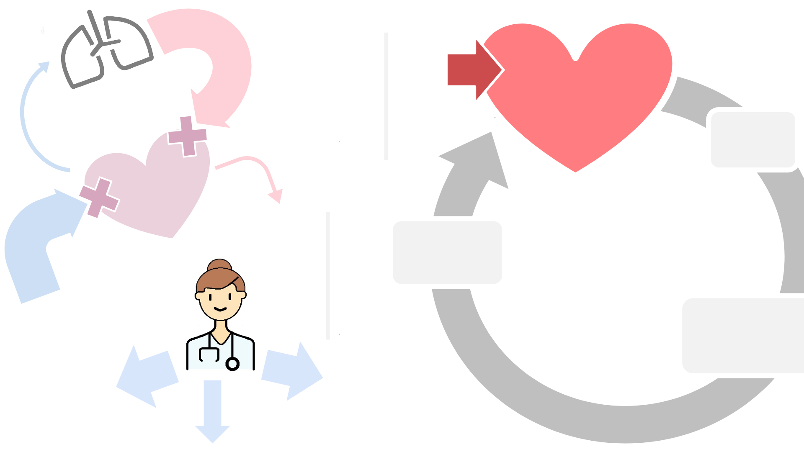
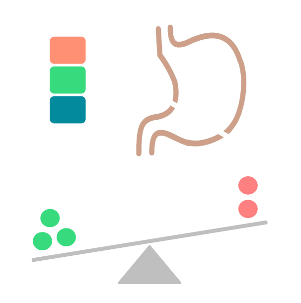

ПЕРВЫЙ СЕМЕСТР   
ПЕРВЫЙ СЕМЕСТР   
ПЕРВЫЙ СЕМЕСТР   
ПЕРВЫЙ СЕМЕСТР   
ПЕРВЫЙ СЕМЕСТР   
ПЕРВЫЙ СЕМЕСТР   
ПЕРВЫЙ СЕМЕСТР   
ПЕРВЫЙ СЕМЕСТР   
ПЕРВЫЙ СЕМЕСТР   

        

|         |Аллергия   |         
| Анемии  
|        
| АГ  
|        
| ХСН (не закончена)  
|        
| Дыхание  
|        
| Желудок (не закончена)  
|        
| Печень  
|        
| Почки  
|        
| Сахарный диабет  
|        
| Эндокринопатии  

<footer>           
by cartographer  
CC BY-NC-SA 4.0
</footer>
