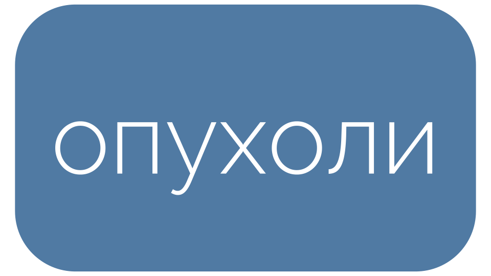
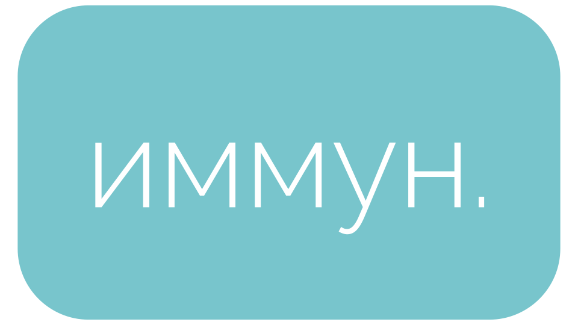
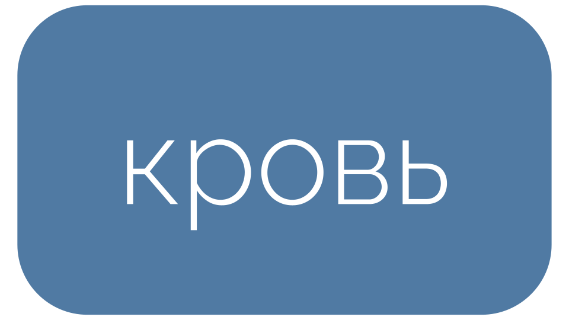
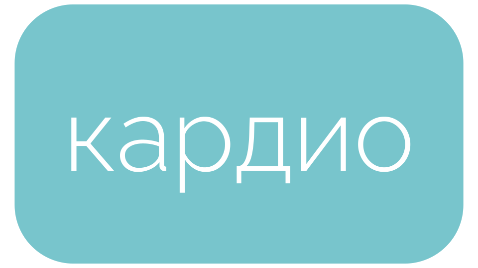
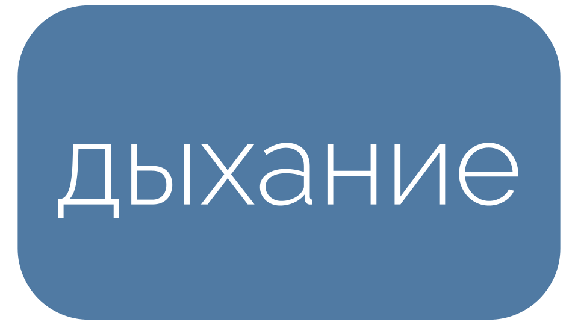
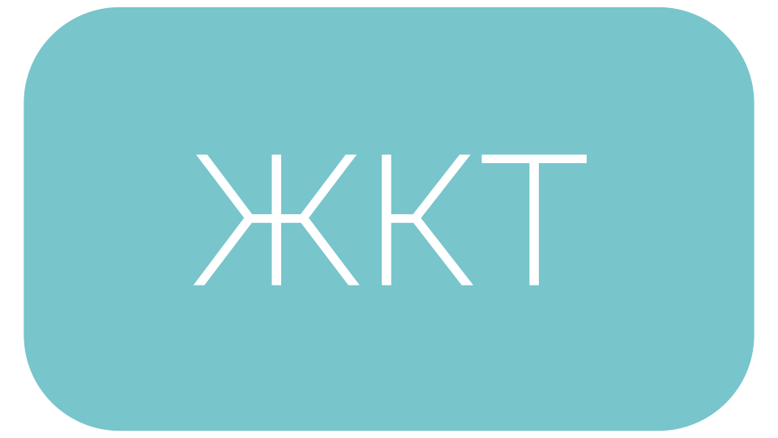
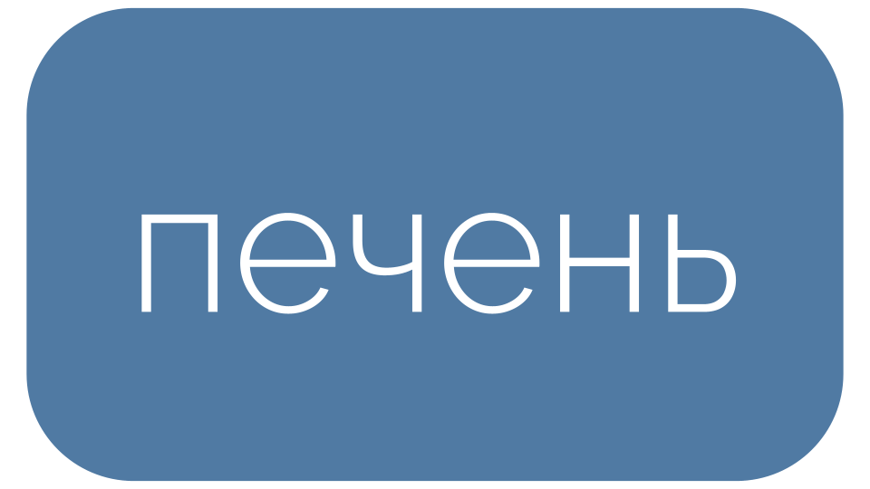
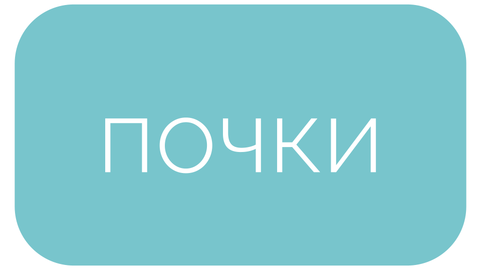
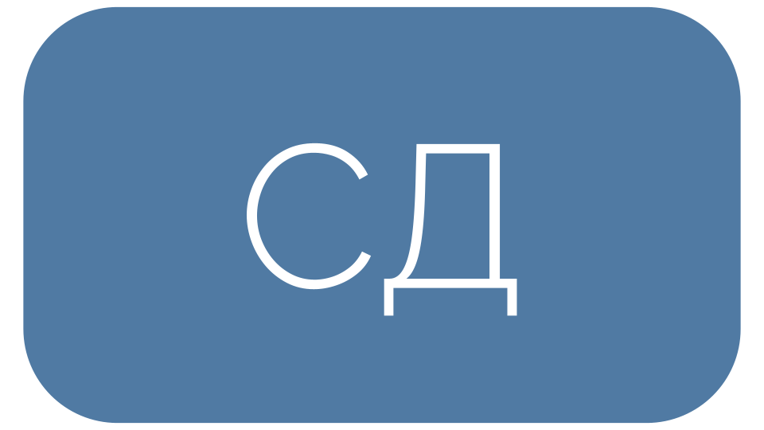
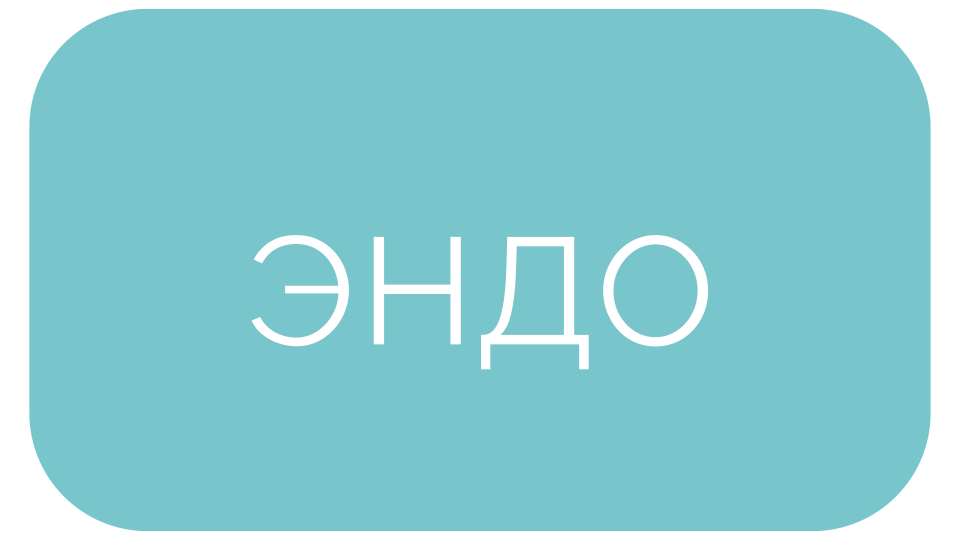

<head>
<link rel="preconnect" href="https://fonts.googleapis.com">
<link rel="preconnect" href="https://fonts.gstatic.com" crossorigin>
<link href="https://fonts.googleapis.com/css2?family=Comfortaa:wght@300..700&display=swap" rel="stylesheet">
<link rel="stylesheet" href="https://fonts.googleapis.com/css?family=Open+Sans&display=swap">  

<link rel="preconnect" href="https://fonts.googleapis.com">
<link rel="preconnect" href="https://fonts.gstatic.com" crossorigin>
<link href="https://fonts.googleapis.com/css2?family=Raleway:ital,wght@0,100..900;1,100..900&display=swap" rel="stylesheet">

<link rel="preconnect" href="https://fonts.googleapis.com">
<link rel="preconnect" href="https://fonts.gstatic.com" crossorigin>
<link href="https://fonts.googleapis.com/css2?family=Montserrat:ital,wght@0,100..900;1,100..900&family=Raleway:ital,wght@0,100..900;1,100..900&display=swap" rel="stylesheet">
</head>

 
оглавление   
     
          

  
ОПУХОЛИ   
[оглавление⤴ ](#оглавление)   

 

 
 
 

  
ИММУНИТЕТ   
[оглавление⤴ ](#оглавление)   

 

 

 

 

 

 
 
 

  
ПАТОЛОГИЯ КРОВИ   
[оглавление⤴ ](#оглавление)   

   

 
 
 

  
КАРДИОЛОГИЯ  
[оглавление⤴ ](#оглавление)   

 

  

  

  

 

 
 
 

  
ДЫХАНИЕ   
[оглавление⤴ ](#оглавление)   

 

 
 
 

  
ЖКТ   
[оглавление⤴ ](#оглавление)   

  

  

  

 
 
 

  
ПЕЧЕНЬ   
[оглавление⤴ ](#оглавление)   

 

 
 
 

  
ПОЧКИ   
[оглавление⤴ ](#оглавление)   

 

 
 
 

  
СД   
[оглавление⤴ ](#оглавление)   

 

 
 
 

 
ЭНДОКРИНОЛОГИЯ   
[оглавление⤴ ](#оглавление)   

 

 
 
 

<footer>           
by cartographer  
CC BY-NC-SA 4.0
</footer>

